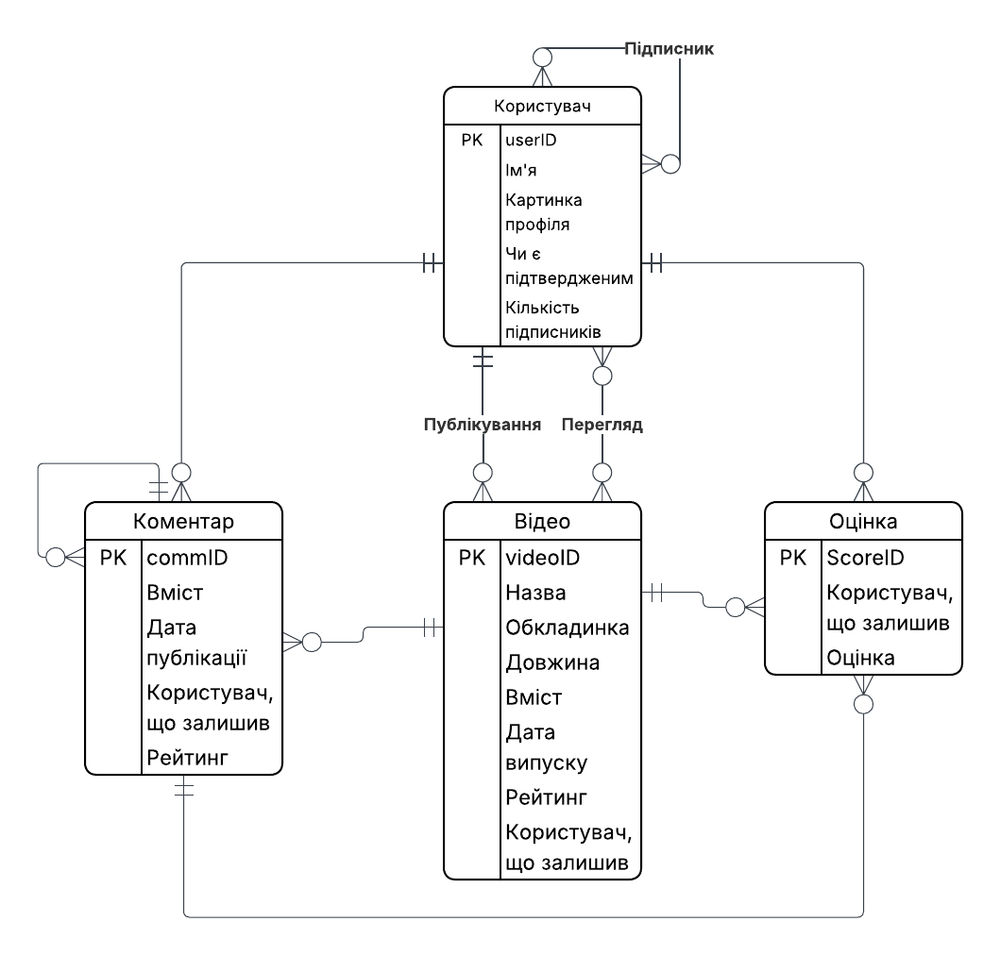

# Осипенко Тимур ІО-46 Лабораторна робота 1: Збір вимог та розробка схеми ER
## Цілі
- Зрозуміти важливість збору та аналізу вимог у проектуванні баз даних.
- Отримати практичний досвід інтерв'ювання зацікавлених сторін та документування функціональних вимог і вимог до даних.
- Навчитись ідентифікувати сутності, атрибути та зв'язки з вимог (знаходження ядер або іменників).
- Створити концептуальну ER-діаграму, яка моделює вимоги до даних.
- Підготуватись до наступних лабораторних робіт: реалізація моделі у вигляді таблиць PostgreSQL, написання SQL-запитів (OLTP/OLAP) та застосування нормалізації та міграцій.
---
## Хід роботи
### Ідея 
Базовий відеохостинг. Користувач може переглядати відео, залишати коментарі, залишати оцінку на коментарі чи відео, підписуватись на інших користувачів.
Коментарі та відео матимуть "рейтинг", що є середнім арифметичним усіх оцінок.
Оцінки працюють так, як вони працювали на ранньому YouTube або так, як вони досі працюють на newgrounds.com
 ### Релізація
 У базі даних зберігатимуться:
 - Користувач (ім'я, картинка профіля, пароль, email, чи є користувач адміністратором, дата приєднання)
 - Відео (назва, обкладинка, вміст, дата випуску, рейтинг)
 - Коментар (вміст, дата публікації, рейтинг)
 - Оцінка (оцінка)

### Пояснення зв'язків:
- Користувач 
    - може бути підписаним на декілька або 0 інших користувачів
    - може мати декілька або 0 підписників
    - може опублікувати декілька або 0 відео
    - може переглянути декілька або 0 відео
    - може залишити декілька або 0 коментарів
    - може поставити декілька або 0 оцінок
- Відео
    - може мати тільки одного користувача-автора 
    - може мати декілька або 0 переглядів
    - може мати декілька або 0 оцінок
    - може мати декілька або 0 коментарів
- Коментар
    - може мати тільки одного автора-користувача
    - може мати декілька або 0 оцінок
    - може мати декілька або 0 коментарів-відповідей
    - коментар-відповідь може належати тільки одному коментарю
- Оцінка
    - може мати лише одного користувача-автора
    - кожна може належати лише одному окремому відео або коментарю

### Припущення, що були зроблені
"Вміст" у Відео, "Картинка профіля" та "Обкладинка" зберігаються у датабазі як назва файлу, наприклад "video.mp4", "picture.jfif".