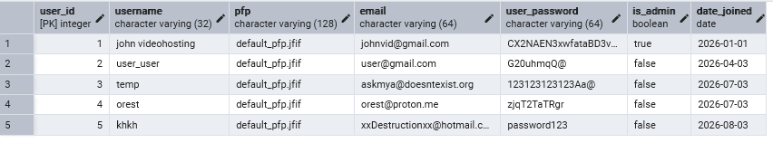
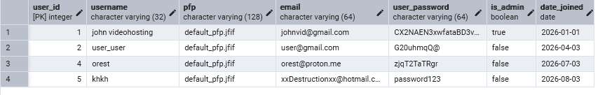
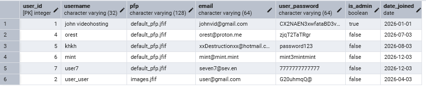

# Осипенко Тимур ІО-46 Лабораторна робота 3: Маніпулювання даними SQL (OLTP)
## Цілі
- Написати запити SELECT для отримання даних (включаючи фільтрацію за допомогою WHERE та вибір певних стовпців).
- Практикувати використання операторів INSERT для додавання нових рядків до таблиць.
- Практикувати використання оператора UPDATE для зміни існуючих рядків (використовуючи SET та WHERE).
- Практикувати використання операторів DELETE для безпечного видалення рядків (за допомогою WHERE).
- Вивчити основні операції маніпулювання даними (DML) у PostgreSQL та спостерігати за їхнім впливом.
---
## Хід роботи
### Запити
~~~

SELECT *
FROM program_user;

--дивиться таблицю program user

DELETE FROM score
WHERE user_id = 3;

DELETE FROM user_comment 
WHERE author_id = 3;

DELETE FROM vid_views
WHERE viewer_id = 3;

DELETE FROM subscriber
WHERE subscriber_id = 3;

DELETE FROM program_user
WHERE user_id=3;

-- видаляє користувача temp та усі пов'язані з ним дані

SELECT *
FROM program_user;

-- перевірка чи видалився користувач temp

INSERT INTO program_user(user_id, username, email, user_password, date_joined) VALUES
    (6, 'mint', 'mint@mint.mint', 'mint3mintmint', '12/03/2026'),
    (7, 'user7', 'seven7@sev.en', '7777777777777', '12/03/2026');

-- додає двох нових користувачів

UPDATE program_user
SET pfp = 'images.jfif' 
WHERE user_id = 2;

-- змінює картинку профілю користувача user_user

SELECT * FROM program_user;

-- показує таблицю користувачів

~~~
### Результати

---
## Висновки
Під час роботи зрозумів, що при створенні таблиць в другій лабораторній роботі можна було запровадити рішення, що значно полігшило і "скоротило" б виконання цієї лабораторної роботи. Йдеться про застосування ON DELETE CASCADE, що видалило б усі релевантні рядки при видаленні користувача.
