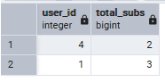
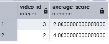
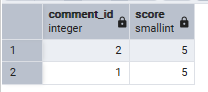
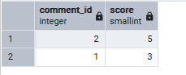
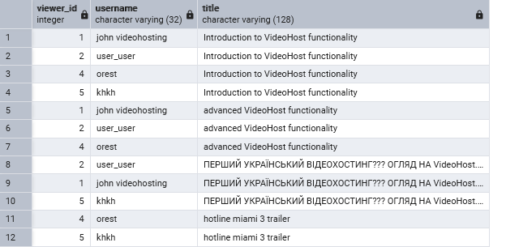
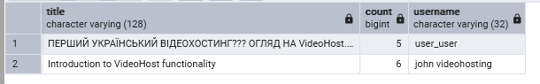

# Осипенко Тимур ІО-46 Лабораторна робота 4: Аналітичні SQL-запити (OLAP)
## Цілі
- Використовувати агрегатні функції, такі як COUNT, SUM, AVG, MIN та MAX, для обчислення зведеної статистики з даних.
- Написати запити GROUP BY для групування рядків за одним або кількома стовпцями та обчислення агрегатів для кожної групи.
- Використати HAVING для фільтрації результатів згрупованих запитів на основі агрегованих умов.
- Виконати операції JOIN (принаймні INNER JOIN та LEFT JOIN), щоб об'єднати дані з кількох таблиць.
- Створити об'єднані запити на агрегацію для кількох таблиць, які об'єднують таблиці та створюють згрупований, агрегований вивід.
---
## Хід роботи
### Запити
~~~

SELECT 
    user_id,
    COUNT(subscriber_id) as total_subs
FROM subscriber
GROUP BY user_id;
-- Кількість підписників кожного користувача

SELECT 
    video_id,
    AVG(score) as average_score
FROM score
WHERE video_id IS NOT NULL
GROUP BY video_id;
-- Середня оцінка кожного відео, IS NOT NULL прибирає коментарі з таблиці, що виводиться.

INSERT INTO score(user_id, comment_id, score) VALUES
	(6, 2, 5), (7, 1, 5), (5, 1, 3);

SELECT
	comment_id,
	MAX(score) as score
FROM score
WHERE comment_id IS NOT NULL
GROUP BY comment_id;
-- Показує максимальну оцінку коментарів

SELECT
	comment_id,
	MIN(score) as score
FROM score
WHERE comment_id IS NOT NULL
GROUP BY comment_id;
-- Показує мінімальну оцінку коментарів

SELECT v.viewer_id, u.username, vd.title
FROM vid_views v
JOIN program_user u
    ON v.viewer_id = u.user_id
JOIN video vd
    ON v.video_id = vd.video_id
-- Показує id користувача, його ім'я та відео які він переглянув

SELECT u.username, v.title
FROM program_user u
LEFT JOIN video v 
    ON u.user_id = v.author_id;
-- Показує користувача і назви відео які він створив, якщо в користувача нема відео то видає NULL

INSERT INTO vid_views(video_id, viewer_id) VALUES
    (1, 6), (1, 7), (2, 6), (3, 6), (3, 7), (4, 7);

Select vd.title, COUNT(viewer_id), author.username
FROM vid_views v
JOIN video vd
    USING (video_id)
JOIN program_user author
    ON vd.author_id = author.user_id
GROUP BY vd.video_id, vd.title, author.username
HAVING COUNT(viewer_id) >= 5;
-- Показати відео, сума переглядів яких =>5. Показати назву відео, загальну кількість переглядів, автора відео 
~~~
### Пояснення
У коментарях до кожного запиту пояснено, що від нього очікується. INSERT використовується для більш очевидного демонстрування.
### Результати

