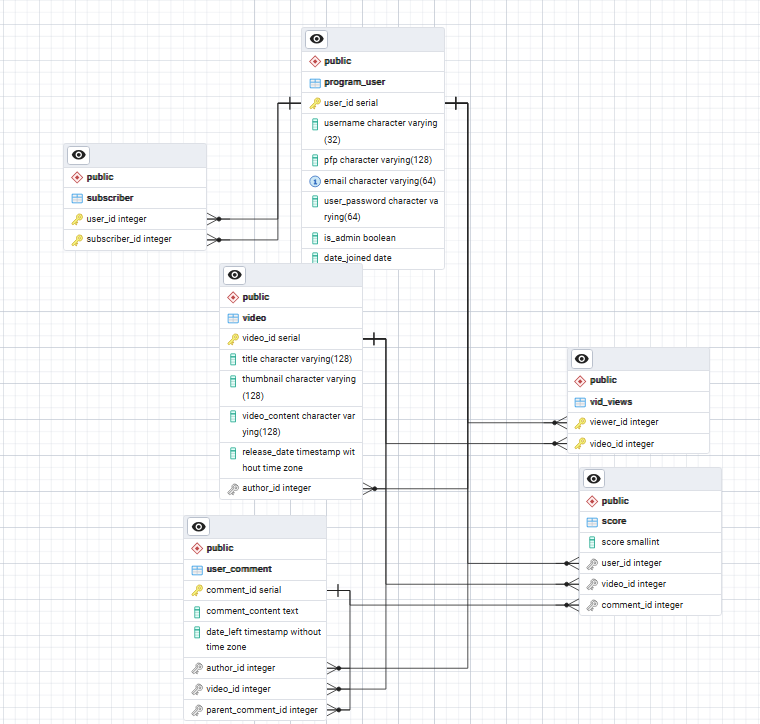
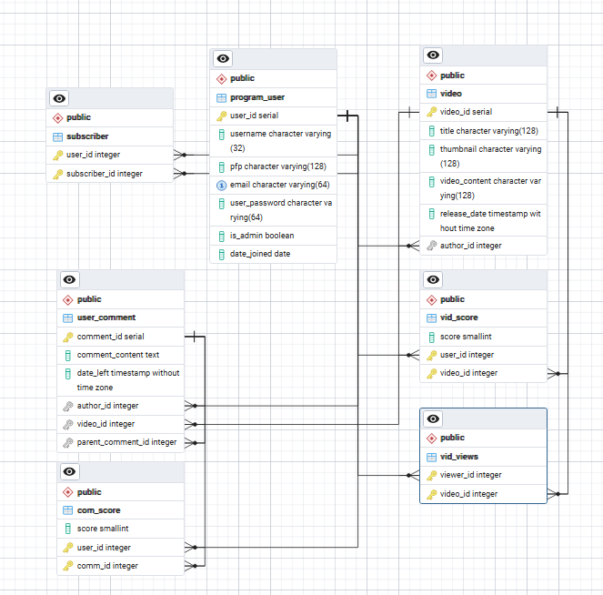

# Аналіз
## Діаграма

## 1NF
Відношення знаходиться в першій нормальній формі, якщо:
    1. Усі атрибути містять лише атомарні (неподільні) значення
    2. Відсутні повторювані групи атрибутів
    3. Кожен запис унікальний
    4. Порядок записів не важливий
---
Усі таблиці відповідають першій нормалній формі
## 2NF
Відношення знаходиться в другій нормальній формі, якщо:
    1.Воно знаходиться в 1НФ
    2.Кожен неключовий атрибут повністю функціонально залежить від первинного ключа (немає часткових залежностей)
## 3NF
Відношення знаходиться в третій нормальній формі, якщо:
    1.Воно знаходиться в 2НФ
    2.Відсутні транзитивні залежності неключових атрибутів від первинного ключа
---
score не відповідає третій нормальній формі, оскільки технічно має два первинних ключа - user_id+video_id та user_id+comment_id залежно від задавання рядку, від обох залежить неключовий атрибут score.

# Рішення
## Абстракція
Усунути транзитивну залежність score можна за допомогою розбиття таблиці на дві різні таблиці - одну для оцінки відео, іншу для оцінки коментаря.
## Запити
~~~
DROP TABLE score;
--Видаляє стару таблицю

CREATE TABLE vid_score(
     score smallint NOT NULL CHECK (score>=1 and score<=5),
     user_id int NOT NULL REFERENCES program_user(user_id),
     video_id int NOT NULL REFERENCES video(video_id),
     PRIMARY KEY (user_id, video_id);
);

CREATE TABLE com_score(
    score smallint NOT NULL CHECK (score>=1 and score<=5),
    user_id int NOT NULL REFERENCES program_user(user_id),
    comm_id int NOT NULL REFERENCES user_comment(comment_id);
    PRIMARY KEY (user_id, comm_id)
);
~~~

## Пояснення
Тепер score залежить лише від обох частин складеного ключового атрибута, а не від двох ключових атрибутів.

## Нова ERD

